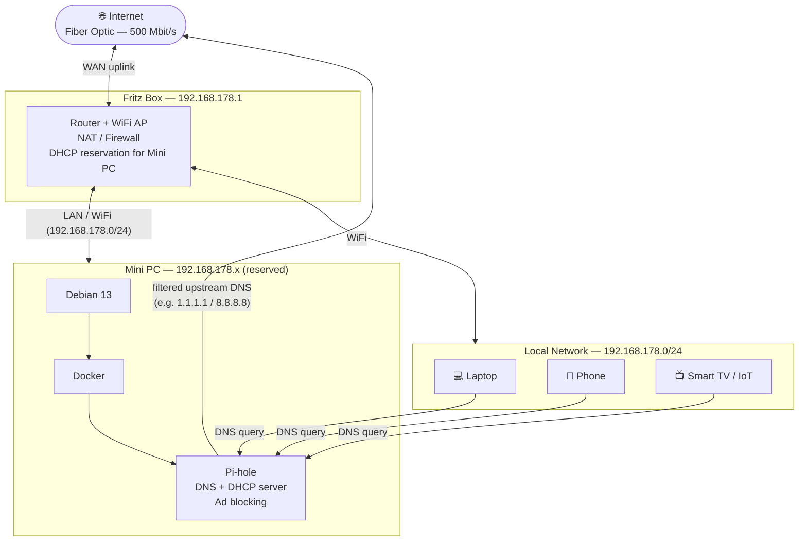

# Homelab Infrastructure

## Overview

A home network built on a mini PC running Debian 13 with Docker, providing network-wide DNS filtering and DHCP via Pi-hole. All local devices route through Pi-hole for ad blocking and DNS control before reaching the internet.

---

## Network Diagram



---

## Components

### Fritz Box
- **Role:** Internet gateway, NAT/firewall, WiFi access point
- **IP:** `192.168.178.1` (default Fritz Box subnet)
- **DHCP:** Fritz Box DHCP has a static reservation for the Mini PC's MAC address, ensuring Pi-hole always gets the same IP
- **DNS:** Configured to point to Pi-hole as the upstream DNS server for all LAN clients

### Mini PC
- **OS:** Debian 13
- **Runtime:** Docker
- **IP:** `192.168.178.x` (DHCP reservation — effectively static)
- **Services:** Pi-hole (container)

### Pi-hole (Docker container)
- **Role:** Network-wide DNS server + DHCP server
- **DNS:** Receives all DNS queries from LAN clients, blocks ads/trackers at DNS level, forwards clean queries to upstream resolvers
- **DHCP:** Issues IP addresses to all LAN clients (Fritz Box DHCP is disabled or Pi-hole takes precedence)
- **Upstream DNS:** Configurable (e.g. Cloudflare `1.1.1.1`, Google `8.8.8.8`, or a local resolver like Unbound)

---

## Traffic Flow

### DNS Resolution
```
Client → Pi-hole (192.168.178.x:53)
           ├─ Blocked domain → NXDOMAIN (ad/tracker blocked)
           └─ Clean domain → upstream DNS → Internet → response back to client
```

### DHCP
```
New device joins network → DHCP request → Pi-hole assigns IP + sets itself as DNS server
```

### General traffic
```
Client → Fritz Box (NAT) → Internet
```

---

## Goals & Planned Expansions

- [ ] **Self-hosted services** — Nextcloud, Jellyfin, Home Assistant, etc.
- [ ] **Network security & monitoring** — traffic analysis, VLAN segmentation, firewall rules
- [ ] **Remote access / VPN** — WireGuard or Tailscale for secure external access
- [ ] **Learning & experimentation** — Kubernetes (k3s), CI/CD, infrastructure as code

---

## Open Questions / To Clarify

- Pi-hole upstream DNS resolver (currently using default — consider adding Unbound for full local resolution)
- Mini PC exact IP address (fill in the `x` in `192.168.178.x`)
- Fritz Box DHCP: fully disabled in favour of Pi-hole, or running alongside?
