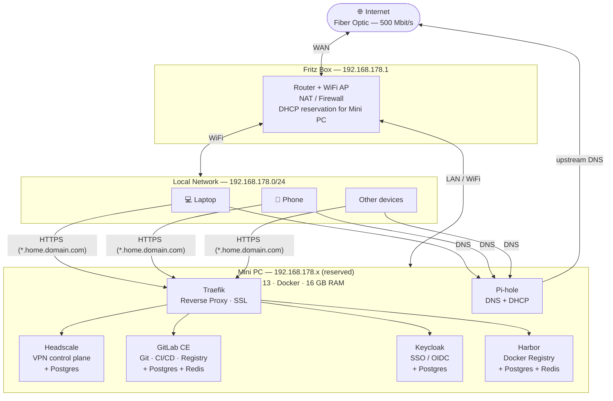

# Homelab Infrastructure

## Overview

A home network built on a mini PC running Debian 13 with Docker, providing network-wide DNS filtering and DHCP via Pi-hole. All services are managed as Infrastructure as Code (Ansible + Docker Compose). Each service stack is fully self-contained with its own database — stacks can be developed, replaced, or torn down independently.

---

## Network Diagram



---

## Service Stacks

Each stack is an independent Docker Compose file with its own database. Stacks can be brought up, torn down, or replaced without affecting others.

### Traefik
- **Role:** Reverse proxy and SSL terminator for all internal services
- **SSL:** Let's Encrypt wildcard cert via DNS challenge (Namecheap API)
- **Domain:** `*.home.<domain>.com` — resolved internally by Pi-hole to Mini PC IP
- **Compose:** `services/traefik/docker-compose.yml`

### Pi-hole
- **Role:** Network-wide DNS server + DHCP server, ad/tracker blocking
- **Internal DNS:** Resolves `*.home.<domain>.com` → Mini PC IP (no split-DNS hairpin needed)
- **Upstream DNS:** Cloudflare `1.1.1.1` / Google `8.8.8.8` (or local Unbound)
- **Compose:** `services/pihole/docker-compose.yml`

### GitLab CE
- **Role:** Git hosting, CI/CD pipelines, IaC source of truth
- **Auth:** OIDC via Keycloak
- **Database:** Dedicated Postgres + Redis containers in the same stack
- **Runners:** GitLab Runner container (same host, 1-2 concurrent builds)
- **Compose:** `services/gitlab/docker-compose.yml`

### Keycloak
- **Role:** SSO identity provider — single login for GitLab, Harbor, Headscale
- **Database:** Dedicated Postgres container in the same stack
- **Compose:** `services/keycloak/docker-compose.yml`

### Harbor
- **Role:** Docker image registry (replaces Docker Hub for internal images)
- **Auth:** OIDC via Keycloak
- **Database:** Dedicated Postgres + Redis containers in the same stack
- **Compose:** `services/harbor/docker-compose.yml`

### Headscale
- **Role:** Self-hosted Tailscale control plane — VPN mesh for remote access
- **Auth:** OIDC via Keycloak
- **Database:** Dedicated Postgres container in the same stack
- **Compose:** `services/headscale/docker-compose.yml`

---

## Infrastructure as Code

### Tooling
| Layer | Tool | Purpose |
|---|---|---|
| Host provisioning | Ansible | Install Docker, configure firewall, users, system settings |
| Secrets | Ansible Vault | All credentials encrypted in the repo |
| Service deployment | Docker Compose (Jinja2 templates) | Ansible renders and deploys each stack |
| Pipeline | GitLab CI | Manages re-deploys after this initial bootstrap |

### Repo Layout
```
homelab/
├── ansible/
│   ├── inventory/
│   │   └── hosts.yml
│   ├── group_vars/all/
│   │   ├── vars.yml          # non-secret variables (domain, IPs, versions)
│   │   └── vault.yml         # ansible-vault encrypted (passwords, API keys)
│   ├── roles/
│   │   ├── common/           # Docker install, firewall (UFW), system users
│   │   ├── traefik/
│   │   ├── pihole/
│   │   ├── gitlab/
│   │   ├── keycloak/
│   │   ├── harbor/
│   │   └── headscale/
│   └── site.yml
├── services/
│   ├── traefik/
│   ├── pihole/
│   ├── gitlab/
│   ├── keycloak/
│   ├── harbor/
│   └── headscale/
└── INFRASTRUCTURE.md
```

### Bootstrap Order
Services must be brought up in dependency order on first install:

```
1. common        → Docker, UFW, system users
2. traefik       → SSL working before any service is exposed
3. pihole        → Internal DNS for *.home.<domain>.com
4. keycloak      → SSO must exist before wiring other services to it
5. gitlab        → Git + CI/CD (then push this repo to it)
6. harbor        → Registry (GitLab CI pushes images here)
7. headscale     → VPN (last, needs Keycloak OIDC)
```

After step 5, GitLab CI takes over re-deployments — Ansible is only needed for host-level changes.

---

## Traffic Flows

### HTTPS (internal browser request)
```
Client → Pi-hole DNS → resolves *.home.<domain>.com → Mini PC IP
Client → Traefik (443) → routes by hostname → service container
```

### CI/CD pipeline
```
git push → GitLab → GitLab Runner builds image → pushes to Harbor
GitLab CI → ansible-playbook / docker compose pull+up → service updated
```

### VPN (remote access)
```
External device → Headscale DERP → Tailscale mesh → Mini PC services
```

### SSO login flow
```
User → service login page → redirect to Keycloak → authenticate → token back to service
```

---

## Open Questions / To Clarify

- Mini PC exact IP address (fill in `192.168.178.x`)
- Fritz Box DHCP: fully disabled in favour of Pi-hole, or running alongside?
- Pi-hole upstream DNS: default resolvers, or add Unbound for full local resolution?
- Namecheap DNS API vs. moving DNS management to Cloudflare (better Traefik support)
- GitLab Runner resource limits (max concurrent builds given 16 GB RAM budget)
