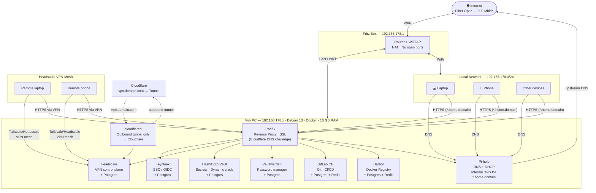

# Homelab Infrastructure

## Overview

A home network built on a single mini PC running Debian 13 with Docker. All services are managed as Infrastructure as Code (Ansible + Docker Compose). Each service stack is fully self-contained with its own database — stacks can be developed, replaced, or torn down independently.

**No public IP. No open ports. No services exposed to the internet.** Remote access is via Headscale VPN only. The sole public-facing endpoint is Headscale's control plane, tunneled through Cloudflare (no port forwarding required).

---

## Network Diagram



---

## Access Model

| From | How | What's accessible |
|---|---|---|
| Local LAN | Direct (192.168.178.0/24) | All `*.home.<domain>` services |
| Remote (VPN) | Headscale mesh → Traefik | All `*.home.<domain>` services |
| Public internet | **Nothing** | Only `vpn.<domain>` (Cloudflare Tunnel → Headscale control plane) |

The Cloudflare Tunnel is outbound-only from the Mini PC. No inbound ports are opened on the Fritz Box. `*.home.<domain>` records resolve to the Mini PC LAN IP via Pi-hole and are unreachable from outside the VPN.

---

## Service Stacks

Each stack is an independent Docker Compose file with its own database.

### Traefik + cloudflared (Priority 2 — infrastructure)
- **Role:** Reverse proxy for all internal services, wildcard SSL, Cloudflare Tunnel sidecar
- **SSL:** Let's Encrypt wildcard cert via Cloudflare DNS API (works without public IP)
- **Tunnel:** `cloudflared` container runs alongside Traefik, routes `vpn.<domain>` → Headscale
- **Compose:** `services/traefik/docker-compose.yml`
- **Note:** Must be deployed before any HTTPS service, but after Keycloak is configured

### Keycloak (Priority 1 — SSO foundation)
- **Role:** Single sign-on identity provider — all services authenticate through here
- **Auth:** All services use OIDC/OAuth2 against Keycloak. No service has its own user database.
- **Database:** Dedicated Postgres container in the same stack
- **Compose:** `services/keycloak/docker-compose.yml`
- **Note:** First service to configure. Create the `homelab` realm and all OIDC clients here before deploying dependent services.

### Headscale (Priority 2 — remote access)
- **Role:** Self-hosted Tailscale control plane, VPN mesh for remote access
- **Public endpoint:** `vpn.<domain>` — routed via Cloudflare Tunnel (not LAN-only)
- **Auth:** OIDC via Keycloak
- **Database:** Dedicated Postgres container in the same stack
- **Compose:** `services/headscale/docker-compose.yml`

### HashiCorp Vault (Priority 3 — secrets automation)
- **Role:** Secrets management for automation and dynamic credentials (e.g. short-lived DB creds for GitLab CI)
- **Init:** Requires manual `vault operator init` on first deploy — store unseal keys in Vaultwarden immediately
- **Database:** Dedicated Postgres container in the same stack
- **Compose:** `services/hcvault/docker-compose.yml`

### Vaultwarden (Priority 3 — password management)
- **Role:** Self-hosted Bitwarden-compatible password manager
- **Implementation:** Vaultwarden (Rust) — lightweight, single container, compatible with all Bitwarden clients
- **Auth:** OIDC via Keycloak
- **Database:** Dedicated Postgres container in the same stack
- **Compose:** `services/vaultwarden/docker-compose.yml`

### Pi-hole (Priority 4)
- **Role:** Network-wide DNS server + DHCP, ad/tracker blocking, internal DNS for `*.home.<domain>`
- **Internal DNS:** All `*.home.<domain>` records point to Mini PC LAN IP — no split-DNS hairpin
- **Upstream DNS:** Cloudflare `1.1.1.1`
- **Compose:** `services/pihole/docker-compose.yml`

### GitLab CE (Priority 4)
- **Role:** Git hosting, CI/CD pipelines, IaC source of truth after bootstrap
- **Auth:** OIDC via Keycloak
- **Database:** Dedicated Postgres + Redis containers in the same stack
- **Runners:** GitLab Runner container, 1-2 concurrent builds (16 GB RAM constraint)
- **Compose:** `services/gitlab/docker-compose.yml`

### Harbor (Priority 4)
- **Role:** Docker image registry — GitLab CI pushes images here
- **Auth:** OIDC via Keycloak
- **Database:** Dedicated Postgres + Redis containers in the same stack
- **Compose:** `services/harbor/docker-compose.yml`

---

## Infrastructure as Code

| Layer | Tool | Purpose |
|---|---|---|
| Host provisioning | Ansible | Docker, UFW, system users, directories |
| Secrets | Ansible Vault | All credentials encrypted in repo |
| Service deployment | Docker Compose (Jinja2 templates) | Ansible renders and deploys each stack |
| CI/CD | GitLab CI | Re-deploys stacks after bootstrap |

### Repo Layout
```
homelab/
├── ansible/
│   ├── inventory/hosts.yml
│   ├── group_vars/all/
│   │   ├── vars.yml          # domain, IPs, service versions
│   │   └── vault.yml         # ansible-vault encrypted secrets
│   ├── roles/
│   │   ├── common/           # Docker, UFW, deploy user
│   │   ├── traefik/          # reverse proxy + SSL + cloudflared
│   │   ├── keycloak/
│   │   ├── headscale/
│   │   ├── hcvault/
│   │   ├── vaultwarden/
│   │   ├── pihole/
│   │   ├── gitlab/
│   │   └── harbor/
│   └── site.yml
├── services/
│   ├── traefik/
│   ├── keycloak/
│   ├── headscale/
│   ├── hcvault/
│   ├── vaultwarden/
│   ├── pihole/
│   ├── gitlab/
│   └── harbor/
├── README.md
└── INFRASTRUCTURE.md
```

### Bootstrap Order
```
common      → Docker, UFW, system users
traefik     → SSL + Cloudflare Tunnel (infrastructure prerequisite)
keycloak    → SSO (configure realm + OIDC clients before continuing)
headscale   → VPN (remote access live after this step)
hcvault     → secrets automation + store Vault unseal keys in Vaultwarden
vaultwarden → password manager
pihole      → DNS + DHCP (migrate existing Pi-hole here)
gitlab      → push this repo to GitLab; CI takes over re-deploys
harbor      → registry
```

---

## Traffic Flows

### Internal browser request
```
Device (LAN or VPN) → DNS query to Pi-hole
Pi-hole → resolves *.home.<domain> → Mini PC LAN IP
Device → Traefik :443 → routes by hostname → service container
```

### Remote access (VPN)
```
Remote device → vpn.<domain> (Cloudflare Tunnel) → cloudflared → Headscale
Headscale → establishes mesh VPN → device acts as if on LAN
Device → *.home.<domain> → Traefik → service
```

### CI/CD pipeline
```
git push → GitLab → Runner builds image → pushes to Harbor
GitLab CI → ansible-playbook → docker compose pull + up → service updated
```

### SSO login
```
User → service → redirect to auth.home.<domain> (Keycloak) → authenticate → token → service
```

---

## Open Questions / To Clarify

- Mini PC exact IP address (fill in `192.168.178.x`)
- Fritz Box DHCP: fully disabled in favour of Pi-hole, or running alongside?
- HashiCorp Vault auto-unseal strategy (cloud KMS vs. manual) — needed after any reboot
- GitLab Runner concurrent build limit (default: 1, increase carefully given 16 GB RAM)
