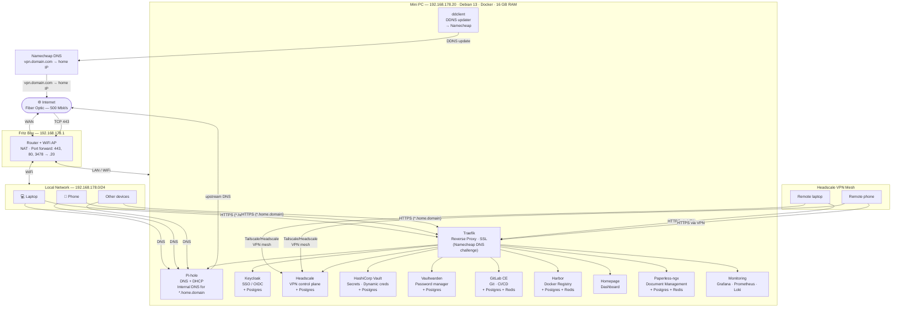

# Architecture

A home network built on a single mini PC running Debian 13 with Docker. All services are managed as Infrastructure as Code (Ansible + Docker Compose). Each service stack is fully self-contained with its own database — stacks can be developed, replaced, or torn down independently.

**Three ports are open on the FritzBox** (TCP 443, TCP 80, UDP 3478), forwarded to the Mini PC. Everything else is LAN/VPN only. Remote access is via Headscale VPN; `vpn.philippthesurfer.com` is the sole public-facing endpoint, kept reachable via Namecheap DDNS.

---

## Network Diagram



---

## Access Model

| From | How | What's accessible |
|---|---|---|
| Local LAN | Direct (192.168.178.0/24) | All `*.home.philippthesurfer.com` services + Pi-hole at `:8080` |
| Remote (VPN) | Headscale mesh → Traefik | All `*.home.philippthesurfer.com` services |
| Public internet | TCP 443 → FritzBox → Traefik → Headscale | Only `vpn.philippthesurfer.com` (Headscale control plane) |

`*.home.philippthesurfer.com` records resolve to the Mini PC LAN IP via Pi-hole and are unreachable from outside the LAN or VPN. Traefik terminates TLS directly — no tunnel or third-party proxy sits between the client and the server.

**Exception:** Keycloak sits at `auth.philippthesurfer.com` (no `.home.` subdomain) so OIDC redirect URIs work from any device, including those not on the LAN or VPN. The DNS record is still private, but the URL scheme is consistent with public OIDC flows.

---

## Service Stacks

Each stack is an independent Docker Compose file with its own database.

### Keycloak (Priority 1 — SSO foundation)
- **Role:** Single sign-on identity provider — all services authenticate through here
- **Auth:** All services use OIDC/OAuth2 against Keycloak. No service has its own user database.
- **Database:** Dedicated Postgres container on an internal-only network
- **Compose:** `services/keycloak/docker-compose.yml`
- **Note:** First service to configure. Create the `homelab` realm and all OIDC clients here before deploying dependent services.

### Traefik + ddclient (Priority 2 — infrastructure)
- **Role:** Reverse proxy for all internal services, wildcard SSL, DDNS updater sidecar
- **SSL:** Let's Encrypt wildcard cert via Namecheap DNS API — DNS challenge allows issuing `*.home.philippthesurfer.com` without exposing internal domains publicly
- **DDNS:** `ddclient` container runs alongside Traefik, updates the `vpn.philippthesurfer.com` A record every 5 minutes via Namecheap's DDNS service
- **Compose:** `services/traefik/docker-compose.yml`

### Headscale (Priority 2 — remote access)
- **Role:** Self-hosted Tailscale control plane, VPN mesh for remote access
- **Public endpoint:** `vpn.philippthesurfer.com` — directly reachable via FritzBox port forward (TCP 443). TLS terminated by Traefik; WebSocket upgrade preserved end-to-end via HTTP/1.1 (`no-h2` TLS option).
- **Auth:** OIDC via Keycloak
- **Database:** Dedicated Postgres container in the same stack
- **Compose:** `services/headscale/docker-compose.yml`

### HashiCorp Vault (Priority 3 — secrets automation)
- **Role:** Secrets management for automation and dynamic credentials (e.g. short-lived DB creds for GitLab CI)
- **Init:** Requires manual `vault operator init` on first deploy — store unseal keys in Vaultwarden immediately
- **Database:** Dedicated Postgres container in the same stack
- **Compose:** `services/hcvault/docker-compose.yml`

### Vaultwarden (Priority 3 — password management)
- **Role:** Self-hosted Bitwarden-compatible password manager
- **Implementation:** Vaultwarden (Rust) — lightweight, single container, compatible with all Bitwarden clients
- **Auth:** OIDC via Keycloak
- **Database:** Dedicated Postgres container in the same stack
- **Compose:** `services/vaultwarden/docker-compose.yml`

### Pi-hole (Priority 4)
- **Role:** Network-wide DNS server + DHCP, ad/tracker blocking, internal DNS for `*.home.philippthesurfer.com`
- **Network mode:** `host` — binds to port 53 and supports DHCP broadcasts, so it is **not** routed through Traefik
- **Internal DNS:** All `*.home.philippthesurfer.com` records point to Mini PC LAN IP — no split-DNS hairpin
- **Upstream DNS:** Cloudflare `1.1.1.1`, Google `8.8.8.8`
- **Compose:** `services/pihole/docker-compose.yml`

### GitLab CE (Priority 4)
- **Role:** Git hosting, CI/CD pipelines, IaC source of truth after bootstrap
- **Auth:** OIDC via Keycloak
- **Database:** Dedicated Postgres + Redis containers in the same stack
- **Runners:** GitLab Runner container, 1–2 concurrent builds (16 GB RAM constraint)
- **Compose:** `services/gitlab/docker-compose.yml`

### Harbor (Priority 4)
- **Role:** Docker image registry — GitLab CI pushes images here
- **Auth:** OIDC via Keycloak
- **Setup:** Uses Harbor's official online installer (not a plain compose file). The `prepare` script generates internal compose config from `harbor.yml`.
- **Database:** Built-in Postgres + Redis managed by the Harbor installer
- **Compose:** `services/harbor/harbor.yml` + `services/harbor/docker-compose.override.yml`

### Homepage (Priority 4)
- **Role:** Homelab dashboard — aggregates all service links, Docker container status, and system widgets
- **Auth:** OIDC via Keycloak
- **Compose:** `services/homepage/docker-compose.yml`

### Paperless-ngx (Priority 4)
- **Role:** Document management — ingest, OCR, tag, and search scanned documents and PDFs
- **Auth:** OIDC via Keycloak; local signups disabled
- **OCR:** German + English; Office documents (docx, xlsx, odt) converted to PDF via Gotenberg/Tika before OCR
- **Database:** Dedicated Postgres + Redis containers in the same stack
- **Compose:** `services/paperless/docker-compose.yml`

### Monitoring (Priority 4)
- **Role:** Observability stack — host + container metrics and log aggregation
- **Components:** Grafana (UI), Prometheus (metrics), Loki (logs), Promtail (Docker log shipper), Node Exporter (host metrics), cAdvisor (container metrics)
- **Auth:** OIDC via Keycloak — login form disabled, all access through Keycloak
- **Traefik metrics:** Prometheus scrapes Traefik's `/metrics` endpoint at `:8082` via the `proxy` Docker network
- **Compose:** `services/monitoring/docker-compose.yml`

---

## Infrastructure as Code

| Layer | Tool | Purpose |
|---|---|---|
| Host provisioning | Ansible | Docker, UFW, system users, directories |
| Secrets | HashiCorp Vault | All credentials in Vault KV v2 (`secret/ansible`); fetched at runtime via `community.hashi_vault` — nothing sensitive in the repo |
| Service deployment | Docker Compose (Jinja2 templates) | Ansible renders and deploys each stack |
| CI/CD | GitLab CI | Re-deploys stacks after bootstrap; authenticates to Vault via AppRole |

### Repo Layout

```
homelab/
├── ansible/
│   ├── inventory/hosts.yml
│   ├── group_vars/all/
│   │   └── vars.yml          # domain, IPs, service versions, HCVault lookups
│   ├── roles/
│   │   ├── common/           # Docker, UFW, deploy user
│   │   ├── docker-log-limit/ # Docker daemon log rotation
│   │   ├── traefik/          # reverse proxy + SSL + ddclient DDNS
│   │   ├── keycloak/
│   │   ├── headscale/
│   │   ├── hcvault/
│   │   ├── vaultwarden/
│   │   ├── pihole/
│   │   ├── gitlab/
│   │   ├── harbor/
│   │   ├── homepage/
│   │   ├── paperless/
│   │   └── monitoring/
│   └── site.yml
├── services/
│   ├── traefik/
│   ├── keycloak/
│   ├── headscale/
│   ├── hcvault/
│   ├── vaultwarden/
│   ├── pihole/
│   ├── gitlab/
│   ├── harbor/
│   ├── homepage/
│   ├── paperless/
│   └── monitoring/
├── docs/
│   ├── architecture.md       # this file
│   ├── bootstrap.md          # step-by-step first deploy
│   ├── ddns.md               # DDNS + TLS cert details
│   ├── vault.md              # Vault CLI, SSH certs, secrets management
│   └── operations.md         # day-to-day ops reference
└── README.md
```

### Bootstrap Order

```
common            → Docker, UFW, system users
docker-log-limit  → daemon log rotation (5 MB per container)
traefik           → SSL + DDNS (infrastructure prerequisite)
keycloak    → SSO (configure realm + OIDC clients before continuing)
headscale   → VPN (remote access live after this step)
hcvault     → secrets automation + store Vault unseal keys in Vaultwarden
vaultwarden → password manager
pihole      → DNS + DHCP
gitlab      → push this repo to GitLab; CI takes over re-deploys
harbor      → registry
homepage    → dashboard
paperless   → document management
monitoring  → metrics + logs
```

---

## Traffic Flows

### Internal browser request
```
Device (LAN or VPN) → DNS query to Pi-hole
Pi-hole → resolves *.home.philippthesurfer.com → Mini PC LAN IP
Device → Traefik :443 → routes by hostname → service container
```

### Remote Headscale registration (new device)
```
Remote device → vpn.philippthesurfer.com
Namecheap DNS → resolves to home IP
FritzBox → port forwards TCP 443 → Traefik → headscale:8080
Headscale → device registered into VPN mesh
```

### Remote access (after VPN connected)
```
Remote device (Headscale VPN) → *.home.philippthesurfer.com
Pi-hole DNS → Mini PC LAN IP → Traefik → service
```

### CI/CD pipeline
```
git push → GitLab → Runner builds image → pushes to Harbor
GitLab CI → AppRole login to Vault → fetch secrets → ansible-playbook → docker compose pull + up → service updated
```

### SSO login
```
User → service → redirect to auth.philippthesurfer.com (Keycloak) → authenticate → token → service
```
